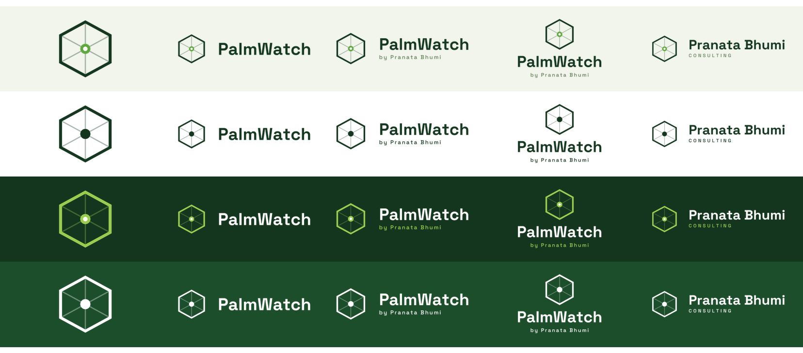

# PalmWatch — Brand Assets

Logomark **Direction A "Presisi"** (heksagon blok kebun + titik survei) dengan
palet **Direction B "Kanopi"**, sesuai revisi `LOGOBRIEF.pdf`.



## Isi

```
brand/
  svg/        20 file — vektor, teks sudah di-outline (tidak butuh font)
  png/        64 file — latar transparan, multi-ukuran
  favicon/    favicon-16..512.png + favicon.ico (multi-size)
  preview.png contact sheet semua varian
  generate_brand_assets.py   generator (reproducible)
  _fonts/     Space Grotesk (SIL OFL 1.1) — hanya untuk regenerasi
```

## Jenis aset

| Nama | Isi | Pakai untuk |
|---|---|---|
| `logomark` | ikon saja (tanpa teks) | favicon, avatar, app icon, watermark |
| `horizontal` | ikon + "PalmWatch" | header web, navbar, email signature |
| `horizontal-tagline` | ikon + "PalmWatch" + "by Pranata Bhumi" | dokumen, cover, presentasi |
| `vertical` | ikon di atas, teks di bawah | poster, merchandise, ruang sempit-tinggi |
| `pranata-horizontal` | ikon + "Pranata Bhumi" + "CONSULTING" | korporat (perusahaan induk) |

## Varian warna

| Varian | Untuk latar | Warna |
|---|---|---|
| `primary` | terang (#F1F5EC / putih) | heksagon #14361F, titik #5FA83F |
| `reversed` | gelap (#14361F / foto gelap) | heksagon & titik #9BCB4F, teks putih |
| `mono-dark` | terang, 1 warna (cetak/stempel) | semua #14361F |
| `mono-white` | gelap/foto, 1 warna | semua putih |

**Pola nama:** `palmwatch-{jenis}-{varian}[-{lebar}w].{svg|png}`
Contoh: `palmwatch-horizontal-tagline-reversed-1024w.png`

## Ukuran PNG tersedia

- `logomark` — 64, 128, 256, 512, 1024 px
- `horizontal`, `horizontal-tagline`, `pranata-horizontal` — 512, 1024, 2048 px (lebar)
- `vertical` — 512, 1024 px (lebar)

Semua PNG **latar transparan**, di-render supersampled (8×/4×) lalu LANCZOS → tepi halus.
Butuh ukuran lain? Ubah `sizes` di generator lalu jalankan ulang.

## Aturan pakai

- **Clear space:** sisakan ruang kosong ≥ ½ lebar heksagon di semua sisi.
- **Ukuran minimum:** logomark 24 px; lockup dengan tagline 120 px lebar
  (di bawah itu tagline tak terbaca — pakai `horizontal` tanpa tagline).
- **Kontras:** jangan pakai `primary` di latar gelap atau `reversed` di latar terang.
  Di atas foto, pakai `mono-white`.
- **Jangan:** ubah proporsi (selalu skala proporsional), ganti warna di luar palet,
  putar/miringkan, tambah bayangan/gradien, atau susun ulang jarak ikon–teks.

## Palet

| Warna | Hex | Peran |
|---|---|---|
| Deep Forest | `#14361F` | teks utama, heksagon (latar terang), header |
| Canopy Green | `#5FA83F` | aksen/CTA, titik survei |
| Leaf Lime | `#9BCB4F` | highlight, logomark di latar gelap |
| Earth Brown | `#8A5A34` | aksen tanah |
| Canopy White | `#F1F5EC` | background |

## Regenerasi

```bash
python brand/generate_brand_assets.py
```

Semua aset (SVG, PNG, favicon, preview) dibuat ulang dari satu sumber — geometri
logomark & konstanta layout ada di satu tempat, jadi SVG dan PNG tak akan berbeda.

> Tipografi: **Space Grotesk** (SIL OFL 1.1). Pada SVG teks sudah di-*outline*
> menjadi `<path>`, sehingga file aman dibuka di mana pun tanpa memasang font.
